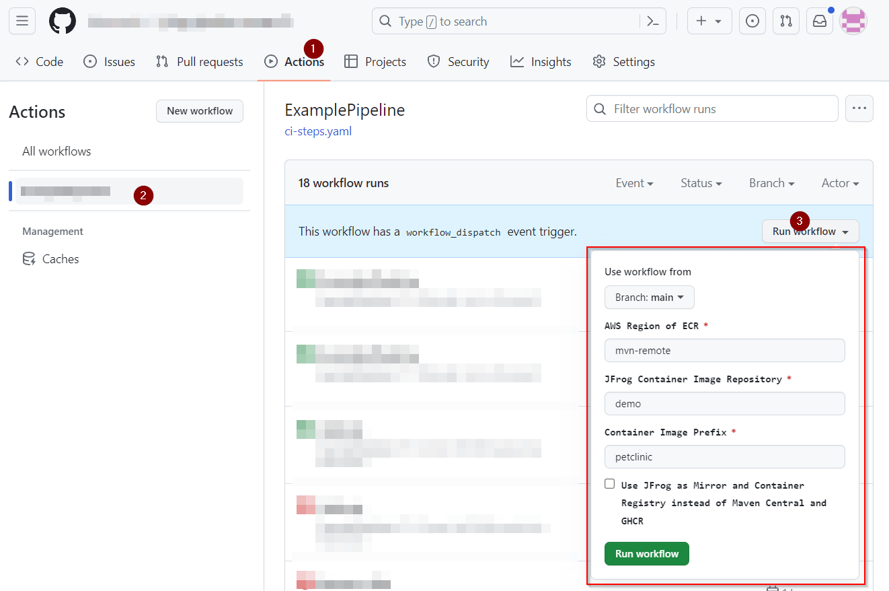
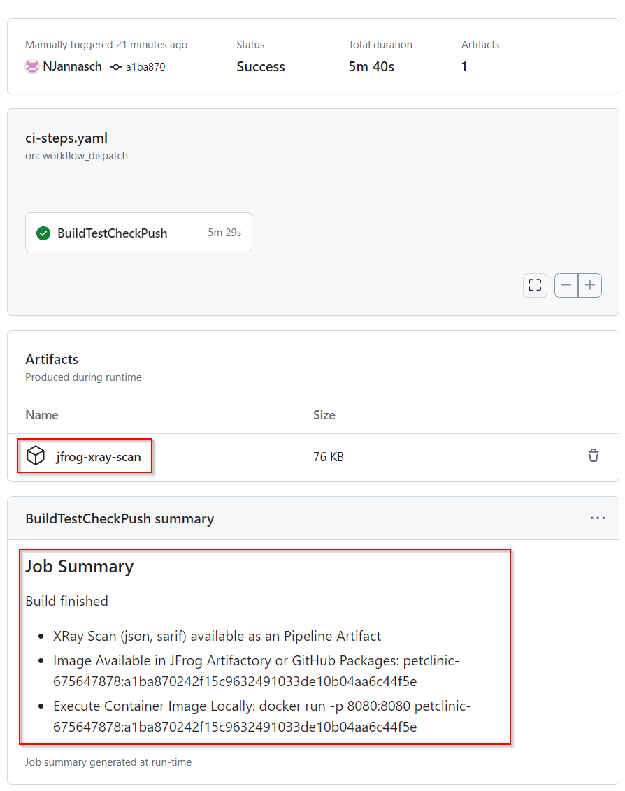
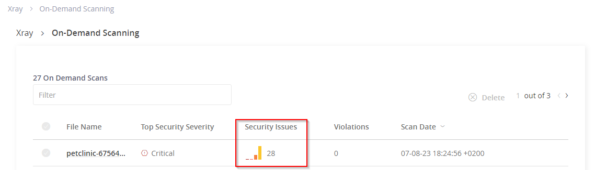
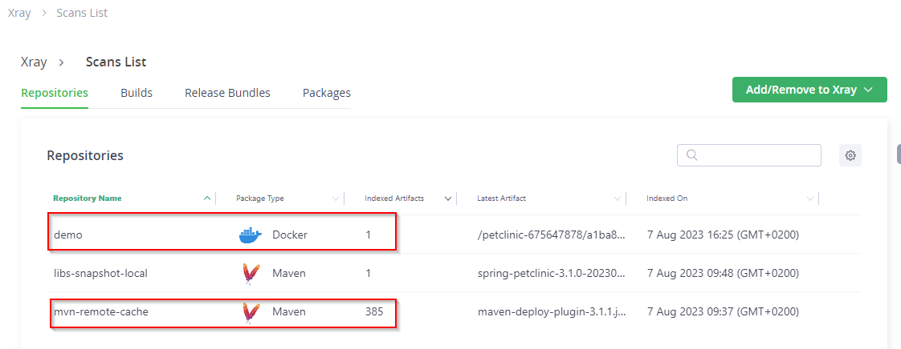
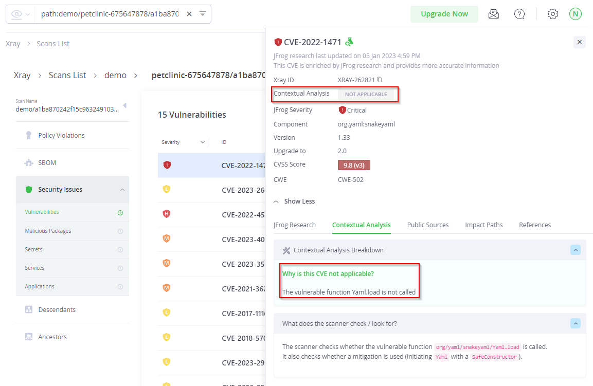
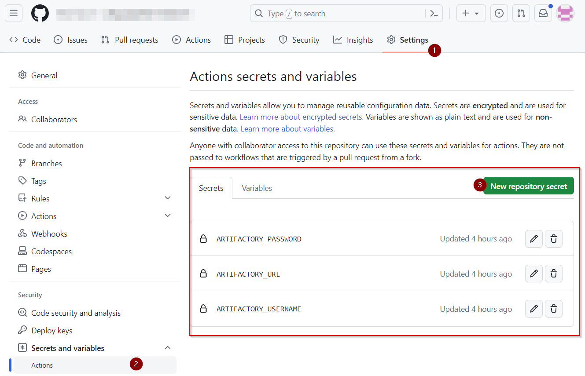

# GitHub Action Petclinic Build

This repository showcases methods to integrate security into CI/CD workflows using GitHub Actions, with a particular emphasis on integrating JFrog's suite of tools.  
To illustrate, we use the [Spring Pet Clinic application](https://github.com/spring-projects/spring-petclinic). Branch-based logic has been omitted for simplicity.

## Table of Contents

- [Getting Started](#getting-started)
    - [CI/CD Configuration](#cicd-configuration)
- [Use-Cases](#use-cases)
  - [Basic Example](#basic-example)
  - [Advanced Example](#advanced-example)
    - [Artifactory Maven Setup](#artifactory-maven-setup)
    - [Artifactory Docker Setup](#artifactory-docker-setup)
  - [Test It](#test-it)
- [Appendix](#appendix)
  - [Execution of Image](#execution-of-image)
- [Screenshots](#screenshots)

## Getting Started

To use JFrog security features, set up your Artifactory. If you don't have a SaaS-based Artifactory:
- [Create a test account](https://jfrog.com/start-free/)

For customization and testing the functionality in the repository create a fork.

### CICD Configuration
To allow scanning with JFrog Xray configure the following GitHub Action secrets:

- ARTIFACTORY_USERNAME
- ARTIFACTORY_PASSWORD
- ARTIFACTORY_URL e.g. .jfrog.io without http/https

[Example](#github-actions-configuration)

## Use-Cases

### Basic Example

In this model:
1. [Maven Central](https://repo1.maven.org/maven2) is the exclusive dependency source. The pipeline modifies `settings.xml` for this purpose (See `templates/settings.maven.template.xml`).
2. The petclinic Java app is built, tested, packaged, and dockerized. *No security measures are adopted up to this point.*
3. The finalized container is scanned by JFrog Xray and then dispatched to the GitHub container registry.

### Advanced Example

This use-case involves JFrog Artifactory serving as a mirror for all external dependencies. It also hosts a container registry, allowing for enhanced security features, transparency about third-party components, contextual analysis, and more. The pipeline modifies `settings.xml` for this purpose (See `templates/settings.jfrog.template.xml`).

#### Artifactory Maven Setup

Configure a Maven remote repository in Artifactory:

- Navigate to: Artifactory -> Repositories -> Create a Repository (Remote)
  1. Choose Maven:
    - Repository Key: **mvn-remote**
    - URL: *https://repo1.maven.org/maven2/*
    - Enable JFrog Xray Integration
  2. Create Remote Repository

#### Artifactory Docker Setup

Configure a repository in Artifactory to store container images:

- Navigate to: Artifactory -> Repositories -> Create a Repository (Local)
  1. Choose Docker:
    - Repository Key: **demo**
    - Enable JFrog Xray Integration
  2. Create Local Repository

## Test It
The pipeline can be triggered under Actions -> Pipeline Name -> Run workflow


Depending of the Basic or Advanced usecase toggle the box.

## Appendix

This pipeline offers a broad scope. For a simpler building process (also allowing local reproducibility), utilize the Dockerfile found under the *additional/* folder:

```bash
# Build
docker build -t petclinik:test -f Dockerfile_staged

# Execute
docker run -p 8080:8080 petclinik:test
```

### Execution of image
Adjust the URL according to the Container Registry being utilized:
```bash
docker run -p 8080:8080 <your-artifactory-url/your-repo-name:tag>
```

# Screenshots
## Basic
Pipeline Summary  



On-Demand scanning results in Artifactory  


## Advanced
JFrog Xray Scan Lists  (Remote/Mirror and Docker Registry)  



Contextual Analysis  


## GitHub Actions Configuration
Secrets Configuration  


# Contribution
If you'd like to contribute to this project, please submit a pull request or open an issue for discussion.

# License
This project is licensed under the AGPL3 License. See the LICENSE file for more details.
